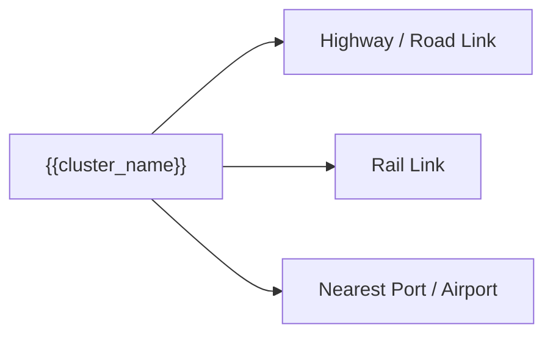

---
title: Warehouse Cluster Template
type: template
category: cluster-intelligence
status: active
---

# Warehouse Cluster Template

```yaml
type: warehouse_cluster
city:
cluster_name:
coordinates:
  lat:
  lng:
radius_km:
industries:
  -
warehouse_types:
  -
connectivity:
  highways:
    -
  rail:
  port:
  airport:
cargo_profile:
  outbound:
    -
  inbound:
    -
avg_daily_truck_movements:
peak_hours:
  -
tier:
backhaul_potential:
data_confidence:
last_updated:
idempotency_key:
status:
```

# {{cluster_name}} - {{city}}

## Industrial Context


## Warehouse Infrastructure

| Type | Capacity | Special Features | Typical Tenants |
| --- | --- | --- | --- |
|  |  |  |  |

## Connectivity Matrix



## Cargo Flow Patterns

| Direction | Primary Cargo | Volume Score | Seasonality |
| --- | --- | ---: | --- |
| Outbound |  |  |  |
| Inbound |  |  |  |

## Triangle Integration Rules

- IF origin = this cluster and cargo matches outbound profile, prioritize matching to strong destination clusters.
- IF backhaul_potential < 5, test incentive pricing for inbound cargo shippers.
- IF peak hour applies, add buffer or departure-window rule.

## Data Provenance

| Claim | Source | Confidence |
| --- | --- | --- |
|  |  |  |

## Validation Tasks

- [ ] Verify cluster boundary
- [ ] Interview 5 transporters serving this cluster
- [ ] Estimate daily truck movement
- [ ] Identify top outbound cargo
- [ ] Identify top inbound cargo
- [ ] Estimate average waiting time
- [ ] Score backhaul potential
```
