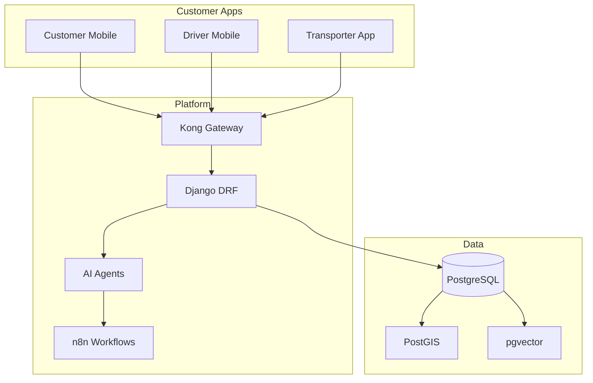

# 🏠 Zippy Logistics Knowledge Base

> [!ABSTRACT] Purpose
> Central nervous system for Zippy Logistics operations, AI governance, and strategic execution.
> **Status:** 🟢 Production Ready Architecture
> **Core Philosophy:** Autonomous Agents + Deterministic State Machine

## 🗺️ Navigation Map

### 🧠 Core Logic
- [[03_ReturnTrip_Algorithm]] | Loop economics & IMS matching (with implementation)
- [[02_Agentic_AI_Application]] | Agent roles, implementation & orchestration
- [[01_Business_Model]] | Revenue, Pricing & Settlement logic
- [[07_State_Machine]] | Locked state graph & transitions
- [[08_Database_Schema]] | Core tables, relationships & indexes

### 📈 Strategy & Market
- [[04_Competitive_Analysis]] | BlackBuck, Rivigo, Porter comparison
- [[05_Marketing_Applications]] | Go-to-market & Customer acquisition

### 🛠 Infrastructure
- [[06_Tech_Stack_Architecture]] | Backend, Frontend, DB & Security
- [[10_API_Reference]] | REST endpoints & error handling
- [[99_Execution_Dashboard]] | Task tracking & Sprint planning

### 📊 Business Intelligence (Auto-Generated)
- [[11_BI_Insights/Logistics Intelligence Dashboard]] | **MASTER HUB** - Central BI navigation
- [[11_BI_Insights/BI_Metrics_Dashboard]] | Live metrics from web & PDF data
- [[11_BI_Insights/BI_Key_Trading_City_Pairs]] | Top 15 logistics corridors (Delhi-Mumbai, etc.)
- [[11_BI_Insights/BI_Route_Cost_Analysis]] | Freight rates by mode (Road/Rail/Air/Water)
- [[11_BI_Insights/BI_Infrastructure_Bottlenecks]] | 63 congestion hotspots & 8 major bottlenecks
- [[11_BI_Insights/BI_Government_Schemes_Opportunities]] | PM Gati Shakti, NLP, DFC, Bharatmala
- [[11_BI_Insights/BI_Modal_Split_Analysis]] | Road vs Rail vs Air vs Water strategies
- [[11_BI_Insights/BI_Growth_Projections_2025-2030]] | Market forecasts to 2030
- [[11_BI_Insights/BI_Report_supply_chain]] | Supply chain insights report
- [[11_BI_Insights/BI_Report_fuel_prices]] | Fuel price insights report
- [[11_BI_Insights/BI_Report_general]] | General logistics news
- [[11_BI_Insights/BI_Report_general]] | General logistics news

## 🏷️ Quick Tags
#strategy #ai-agents #logistics #ops #finance #tech-stack #execution #state-machine #api #bi #metrics

## 📊 System Overview



## 🔍 Search Queries (Dataview)
```dataview
TASK FROM "99_Execution_Dashboard"
WHERE !completed
GROUP BY file.link
```

## 📝 Recent Updates
- **2026-04-05:** Added [[Logistics Intelligence Dashboard]] - Master BI Hub with quick navigation
- **2026-04-05:** Added 5 detailed BI analysis reports: Route Costs, Infrastructure, Government Schemes, Modal Split, Growth Projections
- **2026-04-05:** Added [[BI_Route_Cost_Analysis]] - INR 2.5-3.5/ton-km road, 30% cheaper rail
- **2026-04-05:** Added [[BI_Infrastructure_Bottlenecks]] - 63 congestion hotspots identified
- **2026-04-05:** Added [[BI_Government_Schemes_Opportunities]] - INR 10+ Lakh Cr investment pipeline
- **2026-04-05:** Added [[BI_Modal_Split_Analysis]] - Road 60%, Rail 30%, Water 7%, Air 1%
- **2026-04-05:** Added [[BI_Growth_Projections_2025-2030]] - Market USD 250B → USD 385B by 2030
- **2026-04-05:** Added [[BI_Key_Trading_City_Pairs]] - Top 15 corridors (Delhi-Mumbai #1 with 52 connections)
- **2026-04-05:** Processed 9 PDFs (1.4M+ chars) + 3 web sources
- **2026-04-05:** Added BI Pipeline - Auto-generated insights
- **2026-04-04:** Added [[07_State_Machine]] - Full state graph from MiniMax implementation
- **2026-04-04:** Added [[08_Database_Schema]] - Core tables with relationships
- **2026-04-04:** Added [[10_API_Reference]] - REST endpoints documentation
- **2026-04-04:** Enhanced [[02_Agentic_AI_Application]] - Implementation details
- **2026-04-04:** Enhanced [[03_ReturnTrip_Algorithm]] - IMS agent code

---
*Status: 🟢 Living Knowledge Base*
*Generated: MiniMax Agent + Obsidian Integration*
