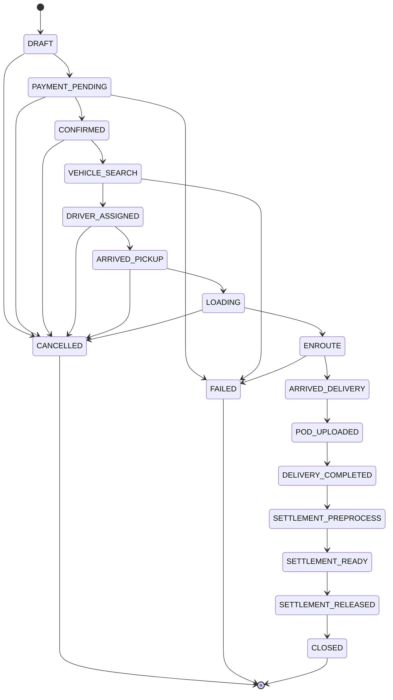

# 🔄 State Machine (Locked)

> [!WARNING] Immutability
> State graph is **LOCKED**. No skipping states, no reverse transitions.
> All changes via `transition()` method only.

## 📊 Canonical State Graph



## 🏷️ State Definitions

| State | Code | Actor | Description |
|-------|------|-------|-------------|
| **DRAFT** | `DRAFT` | OMS | Order created, awaiting payment |
| **PAYMENT_PENDING** | `PAYMENT_PENDING` | OMS | Payment initiated |
| **CONFIRMED** | `CONFIRMED` | OMS | Payment received, searching vehicle |
| **VEHICLE_SEARCH** | `VEHICLE_SEARCH` | IMS | Finding vehicle/driver |
| **DRIVER_ASSIGNED** | `DRIVER_ASSIGNED` | IMS | Vehicle and driver assigned |
| **ARRIVED_PICKUP** | `ARRIVED_PICKUP` | TMS | Driver at pickup location |
| **LOADING** | `LOADING` | TMS | Cargo being loaded |
| **ENROUTE** | `ENROUTE` | TMS | In transit to delivery |
| **ARRIVED_DELIVERY** | `ARRIVED_DELIVERY` | TMS | At delivery location |
| **POD_UPLOADED** | `POD_UPLOADED` | TMS | Proof of delivery submitted |
| **DELIVERY_COMPLETED** | `DELIVERY_COMPLETED` | TMS | Delivery confirmed complete |
| **SETTLEMENT_PREPROCESS** | `SETTLEMENT_PREPROCESS` | FIN | Calculating payouts |
| **SETTLEMENT_READY** | `SETTLEMENT_READY` | FIN | Ready for fund release |
| **SETTLEMENT_RELEASED** | `SETTLEMENT_RELEASED` | FIN | Funds transferred |
| **CLOSED** | `CLOSED` | FIN | Final state |

## Customer-App Policy Overlays

The locked graph remains the execution spine. Customer app business logic adds policy overlays that must be represented in order metadata, payment records, consent records, and event logs without skipping the locked lifecycle states.

Registration and booking checkpoints:

- Organized-company customers require email OTP during registration and order booking submission.
- Individual or unorganized customers require phone OTP during registration and order booking submission.
- Consignee phone OTP is required after POD upload before delivery completion can be treated as fully evidenced for finance and settlement.

ToPay overlay:

- `topay_consent_pending`: consignee has been asked by WhatsApp/SMS whether they accept payer responsibility.
- `topay_consent_accepted`: consignee selected Yes; the payment gateway may open and payment processing continues.
- `topay_consent_denied`: consignee selected No; OMS redirects the obligation to the consignor.
- `on_hold_topay_consent`: consignor selected Hold after consignee denial so payer negotiation can continue.
- `resumed_topay_consent_requested`: consignor resumed a held order and OMS resent the consignee consent request.

Hold/resume rules:

- A hold is a controlled pause, not a reverse transition.
- Resume creates a new event and returns the order to the next legal policy gate, such as ToPay consent, payment pending, or cancellation.
- Every hold must preserve `hold_type`, `hold_reason`, `actor`, `timestamp`, and release/resume evidence.
- UI status can show `ON_HOLD` or `RESUMED`, but backend state changes still go through the transition gateway and audit trail.

Payment/status overlays:

- Full payment can move from `PAYMENT_PENDING` to `CONFIRMED` only after full payment capture is verified.
- Advance payment can move forward only after the required advance or policy-approved authorization clears; loading reminders do not unlock driver movement by themselves.
- ToPay can move forward only after consignee consent and payment/policy gate clear, or after consignor resolves the obligation by full payment or approved exception.
- Payment failure, mismatch, expired consent, document hold, or compliance hold must block progression until a new event resolves the blocking reason.

### Terminal States
- `CANCELLED` - Order cancelled by customer or system
- `FAILED` - Order failed (no vehicle, payment failure, etc.)
- `CLOSED` - Order completed and settled

## 🔒 Transition Rules

### Allowed Transitions (Python Dict)
```python
ORDER_STATE_GRAPH = {
    OrderState.DRAFT: {OrderState.PAYMENT_PENDING, OrderState.CANCELLED},
    OrderState.PAYMENT_PENDING: {OrderState.CONFIRMED, OrderState.FAILED, OrderState.CANCELLED},
    OrderState.CONFIRMED: {OrderState.VEHICLE_SEARCH, OrderState.CANCELLED},
    OrderState.VEHICLE_SEARCH: {OrderState.DRIVER_ASSIGNED, OrderState.FAILED},
    OrderState.DRIVER_ASSIGNED: {OrderState.ARRIVED_PICKUP, OrderState.CANCELLED},
    OrderState.ARRIVED_PICKUP: {OrderState.LOADING, OrderState.CANCELLED},
    OrderState.LOADING: {OrderState.ENROUTE, OrderState.CANCELLED},
    OrderState.ENROUTE: {OrderState.ARRIVED_DELIVERY, OrderState.FAILED},
    OrderState.ARRIVED_DELIVERY: {OrderState.POD_UPLOADED},
    OrderState.POD_UPLOADED: {OrderState.DELIVERY_COMPLETED},
    OrderState.DELIVERY_COMPLETED: {OrderState.SETTLEMENT_PREPROCESS},
    OrderState.SETTLEMENT_PREPROCESS: {OrderState.SETTLEMENT_READY},
    OrderState.SETTLEMENT_READY: {OrderState.SETTLEMENT_RELEASED},
    OrderState.SETTLEMENT_RELEASED: {OrderState.CLOSED},
}
```

### Forbidden Actions
- ❌ No skipping states (e.g., DRAFT → ENROUTE)
- ❌ No reverse transitions (e.g., ENROUTE → DRIVER_ASSIGNED)
- ❌ No jumping to terminal states (except via defined paths)
- ❌ No state change without `idempotency_key`

## 🔐 Transition Method

```python
def transition(self, new_state: OrderState, *, actor: str, event: str, idempotency_key: str):
    """THE ONLY WAY to change order state."""
    current = OrderState(self.state)
    
    # Idempotent retry protection
    if self.last_idempotency_key == idempotency_key:
        return self  # Already processed
    
    # Validate transition
    allowed = ORDER_STATE_GRAPH.get(current, set())
    if new_state not in allowed:
        raise ValidationError(
            f"Illegal state transition: {current} → {new_state}"
        )
    
    # Execute transition
    self.state = new_state
    self.last_event = event
    self.last_actor = actor
    self.last_idempotency_key = idempotency_key
    self.save()
    
    # Create audit event
    OrderEvent.objects.create(
        order=self,
        event_type=event,
        from_state=old_state,
        to_state=new_state,
        actor=actor,
        idempotency_key=idempotency_key
    )
```

## 📝 Audit Trail (Hash-Chained)

Every state change creates an immutable `OrderEvent` record:

| Field | Purpose |
|-------|---------|
| `event_type` | What happened (e.g., `driver_assigned`) |
| `from_state` | Previous state |
| `to_state` | New state |
| `actor` | Who/what made the change (OMS, IMS, TMS, FIN) |
| `idempotency_key` | Unique key for retry protection |
| `payload_hash` | SHA-256 of payload |
| `prev_hash` | Hash of previous event |
| `chain_hash` | Hash(prev_hash + payload_hash) |

> [!INFO] Tamper Detection
> Any modification to audit logs breaks the hash chain, making tampering detectable.

## 🔗 Related Notes
- [[02_Agentic_AI_Application]] - Agent responsibilities
- [[08_Database_Schema]] - Order, OrderEvent models
- [[03_ReturnTrip_Algorithm]] - DELIVERY_COMPLETED trigger

---
*Status: 🟢 Locked*
*Implementation: MiniMax Agent Generated*
