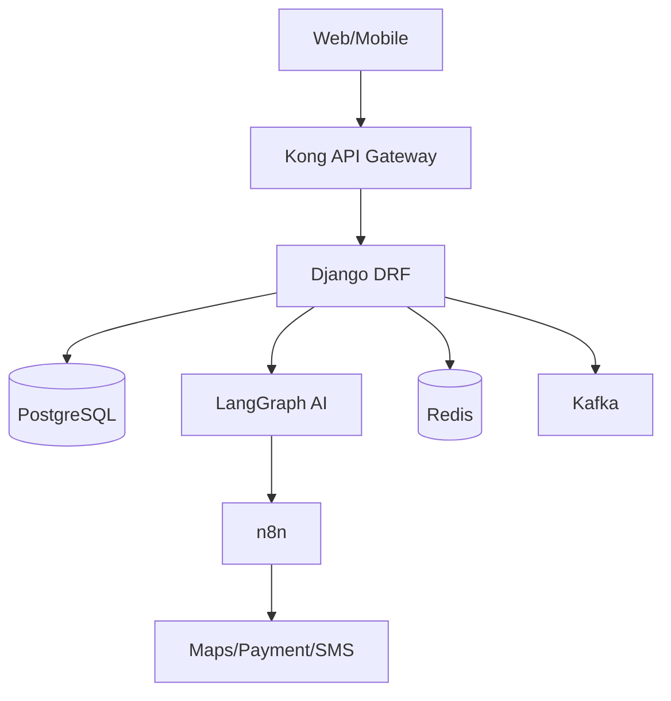

# 🛠 Tech Stack & Architecture

> [!WARNING] Stability
> Production Grade. No experimental tools in core payment/state paths.

## 🏗 High Level Diagram


## 🧱 Stack Breakdown

| Layer               | Technology                    | Notes                                |
| :------------------ | :---------------------------- | :----------------------------------- |
| **API Gateway**     | Kong                          | Rate limiting, Auth, Routing         |
| **Backend**         | Django 4.2 + DRF              | State Machine, Business Logic        |
| **Database**        | PostgreSQL 15 + PostGIS       | Primary DB + GIS support             |
| **Vector Store**    | pgvector                      | AI memory (namespaced per agent)     |
| **AI Agents**       | LangGraph                     | Reasoning, Multi-agent orchestration |
| **Workflow**        | n8n                           | Validation, Retry logic, DLQ         |
| **Message Queue**   | Apache Kafka                  | Event streaming                      |
| **Background Jobs** | Celery + Redis                | Async task processing                |
| **Notifications**   | Twilio + SendGrid             | SMS/WhatsApp + Email                 |
| **Analytics**       | Mixpanel / PostHog            | User behavior tracking               |
| **CRM**             | HubSpot / Salesforce          | Integrated via n8n                   |
| **Maps**            | Google Maps API               | Geocoding, routing                   |
| **Observability**   | Sentry + Prometheus + Grafana | Error tracking, metrics              |

## 📱 Frontend Applications

### Admin Web Dashboard
- **Framework:** React 18 + TypeScript
- **UI:** Material-UI
- **Build:** Vite
- **State:** Redux Toolkit + RTK Query

**Pages:**
| Page | Path | Purpose |
|------|------|---------|
| Dashboard | `/` | Global shipment map, KPIs |
| Orders | `/orders` | Order list, filters |
| Order Detail | `/orders/:id` | Single order view |
| Drivers | `/drivers` | Driver management |
| Vehicles | `/vehicles` | Fleet management |
| Customers | `/customers` | Customer list |
| Disputes | `/disputes` | SLA breach handling |
| Analytics | `/analytics` | Reports, charts |
| Settings | `/settings` | Configuration |

### Mobile Apps (React Native + Expo)
| App             | Users        | Features                               |
| --------------- | ------------ | -------------------------------------- |
| **Customer**    | Shippers     | Book truck, track, pay, history        |
| **Driver**      | Drivers      | Jobs, navigation, POD upload, earnings |
| **Transporter** | Fleet owners | Fleet view, driver mgmt, earnings      |

## 🔐 Security & Compliance

### Authentication
- **Method:** JWT Token + OTP
- **Gateway:** Kong handles auth at edge
- **Roles:** L1 (Customer), L2 (Driver), L3 (Transporter), L4 (Admin)

### Data Protection
- All state transitions logged to immutable hash-chained audit log
- No experimental tools in payment or state mutation paths
- Document encryption for KYC
- OTP-based authentication

### API Security
- Rate limiting via Kong
- Idempotency required for all state changes
- WAF protection
- Request signing for webhooks

## 🗄 Data Architecture

### Primary Database
- **Engine:** PostgreSQL 15
- **Extensions:** PostGIS (GIS), pgvector (AI memory)
- **Host:** Supabase

### Data Retention
| Data Type        | Hot     | Cold    | Archive |
| ---------------- | ------- | ------- | ------- |
| Active Orders    | 90 days | -       | -       |
| Completed Orders | 90 days | 1 year  | S3      |
| Telemetry        | 30 days | 90 days | S3      |
| Audit Logs       | 1 year  | 3 years | Glacier |
| AI Memory        | 90 days | 1 year  | S3      |

### Dead Letter Queue
- **Storage:** Supabase
- **Purpose:** Failed n8n workflows
- **Retention:** 30 days

## 🚀 Deployment

### Container Architecture
```yaml
services:
  web:
    image: zippy-backend:latest
    ports: ["8000:8000"]
  
  worker:
    image: zippy-backend:latest
    command: celery -A config worker
  
  beat:
    image: zippy-backend:latest
    command: celery -A config beat
  
  redis:
    image: redis:7-alpine
  
  kafka:
    image: confluentinc/cp-kafka:latest
```

### Environment Variables
| Variable             | Purpose               |
| -------------------- | --------------------- |
| `DATABASE_URL`       | PostgreSQL connection |
| `REDIS_URL`          | Redis connection      |
| `KAFKA_BROKERS`      | Kafka cluster         |
| `OPENROUTER_API_KEY` | LLM access            |
| `TWILIO_SID`         | SMS/WhatsApp          |
| `GOOGLE_MAPS_KEY`    | Geocoding             |
| `SENTRY_DSN`         | Error tracking        |

## 🔗 Related Notes
- [[02_Agentic_AI_Application]] - Agent implementation
- [[07_State_Machine]] - State transitions
- [[08_Database_Schema]] - Table definitions
- [[10_API_Reference]] - REST endpoints

---
*Status: 🟢 Production Grade*
*Implementation: MiniMax Agent Generated*
