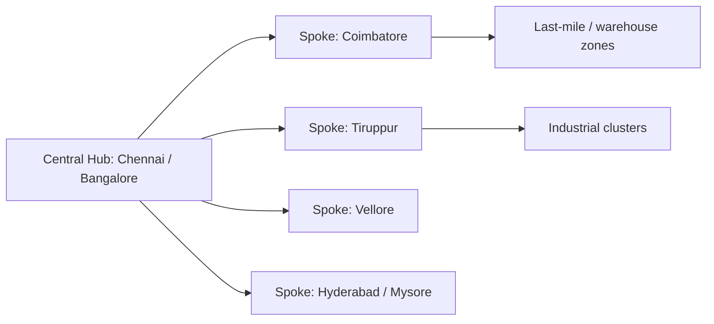

# Logistics Network Implementation Roadmap

## Purpose

Turn the logistics network implementation guide into a practical roadmap for Zippy's warehouse-first startup strategy.

Derived from [[Logistics Network Implementation Source]].

## Core Rule

Build the network in layers, not all at once.

```text
customer segment
-> service promise
-> legal/compliance base
-> physical network topology
-> technology control layer
-> partner execution layer
-> launch KPIs
-> optimization loop
```

## Step 1: Define Strategy And Business Model

| Decision | Zippy Choice |
|----------|--------------|
| target customer | warehouses, MSMEs, transport companies, and specialized industrial shippers |
| early wedge | warehouse-first dispatch and transport coordination |
| business model | asset-light 4PL with selective hybrid control |
| value promise | right vehicle, lower dispatch friction, visibility, evidence, SLA discipline |
| expansion logic | start with dense lanes and warehouse clusters, then add sector modules |

Use:

- [[Customer Segment Value Creation Framework]]
- [[Warehouse Customer Strategy Canvas]]
- [[3PL vs 4PL]]
- [[Cainiao Strategy Patterns for Zippy]]

## Step 2: Build Legal And Compliance Foundation

| Area | Needed Control |
|------|----------------|
| entity setup | company registration, tax setup, bank and accounting controls |
| tax | GST, invoice, TDS/freight treatment where applicable |
| transport documentation | LR/GR, e-way bill, POD, invoice, permit evidence |
| vehicle compliance | RC, insurance, PUC, fitness, payload/size limits |
| driver compliance | license, identity, safety readiness |
| cargo risk | carrier legal liability, goods insurance, damage claim process |
| contract governance | 3PL SLA, partner onboarding, penalties, data sharing, dispute process |

Use:

- [[Legal Compliance Framework]]
- [[Government Warehousing Standards Compliance Layer]]
- [[Transport Fraud & Cybersecurity Framework]]
- [[Reverse Logistics and Return Policy Framework]]

## Step 3: Design Network Topology

| Network Layer | Design Question | Zippy Application |
|---------------|-----------------|-------------------|
| demand zones | where do repeat customers and lanes exist? | Chennai, Redhills, Sriperumbudur, Coimbatore, Tiruppur, Namakkal |
| supply zones | where are trucks, drivers, and transporters dense? | transport nagars, truck terminals, partner fleet clusters |
| warehouse nodes | which customer nodes create repeat flow? | Grade A/B/C warehouses, godowns, cold stores, CFS/ICD nodes |
| topology | direct, hub-and-spoke, cross-dock, FSL, milk run, intermodal | choose by material type, volume, urgency, and lane repeatability |
| service level | Standard, Express, Premium, Dedicated | map to segment value and cost-to-serve |

Network topology decision:

```text
if high volume + one destination:
  direct FTL
elif many nearby drops + repeat windows:
  milk run
elif fragmented regional demand:
  hub-and-spoke or consolidation
elif fast inbound-to-outbound sync:
  cross-dock
elif port/container flow:
  intermodal or CFS/ICD workflow
elif high SLA close to customer:
  forward stocking / partner micro-node
```

Use:

- [[Hub-and-Spoke Network Design Algorithm]]
- [[Warehouse Transport Correlation Algorithm]]
- [[Transport Mode Selection Framework]]
- [[Lane Intelligence Model]]
- [[National Logistics Master Plan]]

## Hub-And-Spoke Design For India

Hub-and-spoke should be the default early scaling model when demand is fragmented but corridors are repeatable.



| Benefit | Zippy Implementation |
|---------|----------------------|
| consolidation efficiency | IMS batches orders by corridor and vehicle fit |
| route simplification | TMS plans hub-to-spoke-to-customer movement |
| economies of scale | pricing engine applies volume and hub-level rate logic |
| scalability | add spokes through configuration and partner onboarding |
| visibility | hub events become clean tracking and exception checkpoints |

Do not force every movement through a hub. Direct FTL, port/container, cold-chain, and high-value urgent loads may bypass the hub when handling risk or SLA makes consolidation harmful.

## Six-Phase Strategic Planning Framework

| Phase | Timebox | Objective | Deliverable |
|-------|---------|-----------|-------------|
| 1. Market and demand analysis | Weeks 1-2 | map pincode density, corridors, competitor gaps, and segment service needs | demand heatmap, corridor profitability matrix |
| 2. Network topology design | Weeks 3-4 | choose hubs, spokes, radius, cross-docks, FSLs, and service tier routing rules | topology plan and hub/spoke configuration |
| 3. Technology and data infrastructure | Weeks 5-6 | wire PostGIS, tracking, forecasting, OR-Tools jobs, Redis cache, and dashboards | network data stack and event model |
| 4. Operational playbooks | Weeks 7-8 | define hub dwell, cut-offs, spoke batching, POD, returns, and exceptions | SOPs and automation triggers |
| 5. Pilot and validation | Weeks 9-10 | run controlled pilot on one hub and selected spokes | KPI validation report |
| 6. Scale and optimize | Weeks 11+ | add second hub, inter-hub corridor, premium tiers, and continuous optimization | expansion playbook |

## Pilot Design

| Pilot Control | Initial Target |
|---------------|----------------|
| geography | Chennai hub plus Coimbatore, Tiruppur, and Vellore spokes |
| volume | about 200 orders/day |
| duration | 14 days |
| hub dwell time | under 45 minutes average |
| empty-leg reduction | at least 20% versus baseline |
| on-time delivery | at least 92% |
| cost per order | at least 15% lower than direct-routing baseline |
| driver feedback | at least 4.0/5 |
| customer NPS | at least 35 on pilot corridors |

Rollout rule:

```text
if pilot metrics pass and no severe incidents:
  approve next hub or spoke rollout
else:
  tune topology, partner pool, pricing, or SOP before scaling
```

## Step 4: Build Scalable Technology Stack

| Layer | Role |
|------|------|
| customer app / portal | booking, tracking, payment status, documents, return requests |
| OMS | order truth, state transitions, customer promise, exception holds |
| WMS / warehouse integration | dispatch readiness, inventory signal, dock status, handling constraints |
| IMS / fleet layer | vehicle, driver, and partner availability |
| TMS | routing, assignment, ETA, dispatch, tracking, route deviation |
| payments/settlement | advance, ToPay, provider payout, refund/claim hold |
| compliance | GST, e-way bill, LR/GR, permits, insurance, audit trail |
| reverse logistics | return order, rejected delivery, reusable packaging recovery |
| control tower | SLA, KPI, bottleneck, exception, carrier score |

The first version should emphasize event discipline over expensive automation:

```text
order_created
vehicle_assigned
gate_in
loading_started
loading_completed
dispatch_started
in_transit
delivery_attempted
delivered
POD_uploaded
settlement_closed
return_started
```

Use:

- [[Order Lifecycle]]
- [[TMS Execution Architecture]]
- [[Autonomous Logistics Execution Architecture]]
- [[Operational Observability Architecture]]

## Agent Coordination Pattern

| Agent / System | Network Role |
|----------------|--------------|
| OMS | route order to hub, direct route, cross-dock, or special workflow |
| IMS | allocate vehicle by hub/spoke, capacity, return-trip fit, and partner pool |
| TMS | plan hub-to-spoke-to-last-mile movement, ETA, deviation, and rerouting |
| pricing | apply hub-level discounts, fuel surcharge, corridor surcharge, and minimum order thresholds |
| finance | settle hub-level discounts, partner payout, refunds, and claim holds |
| forecasting | predict regional demand, spoke volume, and rebalancing needs |
| control tower | monitor hub dwell, SLA breach, empty leg, exception queue, and network health |

Data infrastructure:

| Tool | Role |
|------|------|
| PostGIS | demand clustering, corridor queries, radius decisions, live vehicle geometry |
| Redis | hub capacity and vehicle availability cache |
| Celery | async optimization jobs and forecast refresh |
| OR-Tools | VRP, batching, pickup/drop sequencing, return-trip matching |
| Grafana | pilot KPI and network health dashboard |

## Step 5: Establish Operations And Partnerships

| Operating Area | Startup Need |
|----------------|--------------|
| order workflow | booking, validation, vehicle planning, assignment, tracking, POD, settlement |
| partner network | onboard transporters, drivers, warehouses, 3PLs, specialist carriers |
| 4PL governance | platform owns standards, partner score, SLA, data model, and exception process |
| collaborative network | formalize shared transport, shared warehousing, return-trip sharing, and enterprise shipper integrations |
| market-entry partnerships | use local capacity, demand, technology, and strategic partners to reduce launch risk |
| warehouse desks | cluster-level dispatch support where density is high |
| insurance and claims | clear liability, evidence checklist, settlement hold |
| reverse flow | returns, reattempts, rejected delivery, packaging recovery |

Partner rule:

```text
Do not outsource the customer promise.
Outsource physical execution where useful,
but keep visibility, standards, SLA scoring, and escalation inside the platform.
```

Use:

- [[Transport Operations Implementation Framework]]
- [[Cainiao Post Campus Case Source]]
- [[Carrier Scoring Algorithm]]

## Step 6: Launch And Optimize

| Launch Control | KPI |
|----------------|-----|
| milestone ownership | each network build stage has owner and date |
| service availability | percentage of orders served in launch lanes |
| matching performance | p95 assignment time |
| reliability | on-time pickup and delivery |
| visibility | tracking event completeness |
| network efficiency | empty km, utilization, return-load match rate |
| cost | cost per order and cost per km |
| customer experience | support response, dispute rate, NPS |
| reverse flow | return-to-receipt cycle time and claim closure |

### Strategic KPI Framework

| KPI Group | Metric | Target |
|-----------|--------|--------|
| operational | hub throughput | at least 50 orders/hour after stabilization |
| operational | spoke delivery time | under 4 hours for Express where geography supports it |
| operational | empty-leg reduction | at least 25% versus baseline |
| operational | on-time delivery | 95% Premium, 90% Express |
| financial | network-adjusted cost per order | reduce 15% YoY after scale |
| financial | vehicle utilization | at least 85% on mature corridors |
| financial | hub operating margin | at least 20% after stabilization |
| customer | NPS by service tier | 50 Premium, 35 Express |
| customer | order accuracy | at least 98% with no re-delivery |
| customer | tracking satisfaction | at least 4.5/5 |

### Resilience Rules

| Risk | Mitigation |
|------|------------|
| demand volatility | dynamic partner capacity and vehicle onboarding/offboarding |
| hub disruption | alternate hub or direct-route fallback |
| fuel price spike | fuel surcharge and route optimization |
| regulatory change | config-driven compliance rules by state/cargo type |
| manual exception overload | automated SLA breach flags and support queue creation |

Optimization loop:

```text
measure lane and node performance
-> identify bottleneck
-> remove non-value activity
-> adjust partner, route, topology, or SLA
-> update rules and scorecards
-> repeat weekly
```

## 90-Day Implementation Sequence

| Period | Build Focus | Output |
|--------|-------------|--------|
| Days 1-15 | segment and lane validation | target customer list, launch lanes, service tiers |
| Days 16-30 | compliance and partner foundation | contracts, insurance checks, partner onboarding, document rules |
| Days 31-45 | core OMS/TMS workflow | order lifecycle, assignment, tracking, POD, notifications |
| Days 46-60 | warehouse-cluster operations | dispatch checklist, dock/gate events, support desk, first KPIs |
| Days 61-75 | carrier scoring and control tower | SLA dashboard, partner score, exception queue |
| Days 76-90 | optimization and expansion | add lanes, refine topology, launch return flow, prepare premium capacity |

## Related Notes

- [[Logistics Network Implementation Source]]
- [[Hub-and-Spoke Network Design Algorithm]]
- [[Transport Operations Implementation Framework]]
- [[Collaborative Logistics Network Framework]]
- [[Partnership-Led Market Entry Framework]]
- [[Customer Segment Value Creation Framework]]
- [[Warehouse Customer Strategy Canvas]]
- [[Warehouse Transport Correlation Algorithm]]
- [[Reverse Logistics and Return Policy Framework]]
- [[Cainiao Strategy Patterns for Zippy]]
- [[Government Warehousing Standards Compliance Layer]]
