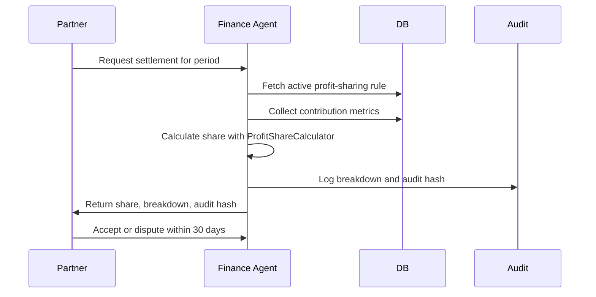

# Strategic Profit Sharing Framework

## Purpose

Define fair, auditable, and scalable profit-sharing logic for Zippy partnerships across transport companies, drivers, warehouses, ecommerce platforms, and strategic alliances.

Implementation artifact: [[ProfitShareCalculator]]

## Core Principle

Profit sharing is relationship architecture, not only arithmetic. The formula must reward real contribution while protecting Zippy's platform margin and preserving trust through transparent calculation breakdowns.

## Model Selection

| Model | Best For | Logic |
|-------|----------|-------|
| contribution_weighted | transport companies, fleet partners, warehouses | partner share is based on capacity, revenue, risk, and strategic value |
| tiered_volume | driver-owners, small transport providers, MSME partners | partner share changes by monthly order volume |
| dynamic_margin | strategic alliances and joint ventures | partner share adjusts against actual margin and growth |

## Contribution-Weighted Formula

```text
contribution_score =
  capacity_pct * 0.40 +
  revenue_generated_pct * 0.30 +
  risk_score * 0.20 +
  strategic_bonus_pct * 0.10

partner_share_pct = contribution_score * base_commission_rate
```

Use this as the default first model because it is explainable and aligns incentives without requiring complex quarterly negotiations.

## Tiered Volume Model

| Monthly Orders | Rate | Bonus |
|----------------|------|-------|
| 0-50 | 18% | 0% |
| 51-200 | 15% | 2% |
| 201-999 | 12% | 4% |
| 1000+ | 10% | 6% |

The tiered model returns the final partner share directly. It should not be multiplied again by base commission.

## Dynamic Margin Model

The dynamic model is for mature relationships where Zippy and the partner can share upside based on actual profitability.

Rules:

| Guardrail | Default |
|-----------|---------|
| minimum Zippy platform margin | 8% |
| maximum partner share | 35% |
| growth bonus threshold | 1.20 |
| growth bonus | 10% uplift on eligible base share |

## Finance Agent Controls

| Control | Requirement |
|---------|-------------|
| active rule lookup | settlement must use the active rule for the settlement period |
| margin protection | partner share cannot reduce Zippy below minimum platform margin |
| cap enforcement | partner share cannot exceed configured maximum |
| audit hash | every calculation must include a deterministic hash |
| transparent breakdown | partners receive the calculation components with each settlement |
| model change | changing model type requires agreement update and audit trail |

## Unit Test Coverage

Test artifact: [[ProfitShareCalculator.test]]

The test suite covers contribution-weighted share, tiered-volume tier matching, highest-tier fallback, dynamic-margin growth bonus, platform margin protection, max partner cap, invalid metric clamping, missing tier config errors, deterministic audit hash, and zero-margin settlement safety.

## Database Objects

Recommended rule table:

```sql
CREATE TABLE partnership_profit_sharing_rules (
  id UUID PRIMARY KEY DEFAULT gen_random_uuid(),
  partnership_id UUID NOT NULL REFERENCES partnerships(id),
  model_type TEXT NOT NULL CHECK (model_type IN (
    'contribution_weighted',
    'tiered_volume',
    'dynamic_margin'
  )),
  capacity_weight NUMERIC(3,2) DEFAULT 0.40,
  revenue_weight NUMERIC(3,2) DEFAULT 0.30,
  risk_weight NUMERIC(3,2) DEFAULT 0.20,
  strategic_weight NUMERIC(3,2) DEFAULT 0.10,
  tier_config JSONB,
  min_platform_margin NUMERIC(3,2) DEFAULT 0.08,
  max_partner_share NUMERIC(3,2) DEFAULT 0.35,
  growth_bonus_threshold NUMERIC(3,2) DEFAULT 1.20,
  base_commission_rate NUMERIC(3,2) NOT NULL,
  sunset_clause JSONB,
  exit_adjustment_formula TEXT,
  effective_from TIMESTAMPTZ NOT NULL DEFAULT now(),
  effective_until TIMESTAMPTZ,
  created_at TIMESTAMPTZ DEFAULT now(),
  updated_at TIMESTAMPTZ DEFAULT now(),
  UNIQUE(partnership_id, effective_from)
);
```

## Settlement Flow



## Quarterly Recalibration

| Rule | Default |
|------|---------|
| review frequency | quarterly |
| variance trigger | contribution estimate differs by more than 15% |
| maximum annual rate change | 5% |
| model change | requires mutual consent |
| notice period | 30 days before new rule |

## Related Notes

- [[Payment Settlement Agent]]
- [[PartnershipAgreement.yaml]]
- [[Collaboration Risk Opportunity Balance Framework]]
- [[Partnership Health Score Calculator]]
- [[Collaborative Logistics Network Framework]]
- [[Partnership-Led Market Entry Framework]]
