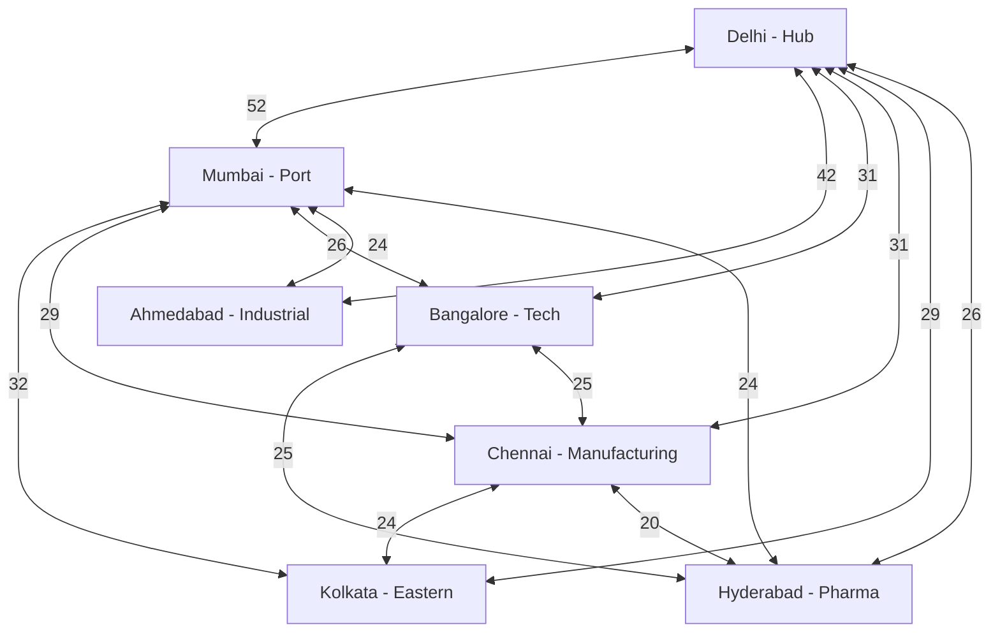

# Key Trading Pair Cities - India Logistics

> [!ABSTRACT] Analysis Summary
> Extracted from 9 industry PDFs + web scraping
> 1,814 insights processed | 90 metrics extracted
> Generated: 2026-04-05

## Top 15 Logistics City Pairs

| Rank | City Pair | Frequency | Corridor Type |
|------|-----------|-----------|---------------|
| 1 | **Delhi ↔ Mumbai** | 52 | Golden Quadrilateral (Primary) |
| 2 | **Ahmedabad ↔ Delhi** | 42 | Gujarat Industrial Route |
| 3 | **Kolkata ↔ Mumbai** | 32 | East-West Coastal |
| 4 | **Bangalore ↔ Delhi** | 31 | Tech Hub Connection |
| 5 | **Chennai ↔ Delhi** | 31 | South-North Manufacturing |
| 6 | **Chennai ↔ Mumbai** | 29 | Coastal Manufacturing |
| 7 | **Delhi ↔ Kolkata** | 29 | Eastern Freight Corridor |
| 8 | **Bangalore ↔ Mumbai** | 26 | IT/Pharma Logistics |
| 9 | **Delhi ↔ Hyderabad** | 26 | Central-South Corridor |
| 10 | **Bangalore ↔ Hyderabad** | 25 | South Tech Triangle |
| 11 | **Ahmedabad ↔ Mumbai** | 24 | Gujarat-Maharashtra Trade |
| 12 | **Chennai ↔ Kolkata** | 24 | Southeast Coastal |
| 13 | **Hyderabad ↔ Mumbai** | 24 | Pharma/Food Corridor |
| 14 | **Delhi ↔ Pune** | 20 | Auto Manufacturing |
| 15 | **Chennai ↔ Hyderabad** | 20 | South Manufacturing |

## Key Hub Cities

### 1. Delhi (222 mentions)
- **Role**: National logistics nucleus
- **Top connections**: Mumbai (52), Ahmedabad (42), Bangalore (31)
- **Significance**: Appears in 8 of top 15 trading pairs

### 2. Ahmedabad (207 mentions)
- **Role**: Gujarat industrial gateway
- **Top connections**: Delhi (42), Mumbai (24)
- **Significance**: Major manufacturing and export hub

### 3. Mumbai (95 mentions)
- **Role**: Financial + port city
- **Top connections**: Delhi (52), Kolkata (32), Chennai (29)
- **Significance**: Western coastal trade gateway

### 4. Bangalore (60 mentions)
- **Role**: Tech/Pharma logistics hub
- **Top connections**: Delhi (31), Mumbai (26), Hyderabad (25)
- **Significance**: High-value cargo (electronics, pharmaceuticals)

### 5. Chennai (High frequency)
- **Role**: Southern manufacturing center
- **Top connections**: Delhi (31), Mumbai (29), Kolkata (24)
- **Significance**: Auto + electronics manufacturing corridor

## Strategic Corridors

## Business Implications

### High-Volume Routes (Target for Zippy)
1. **Delhi-Mumbai**: Fleet deployment, regular scheduling
2. **Ahmedabad-Delhi**: Industrial freight focus
3. **Bangalore-Hyderabad**: Tech/pharma express service

### Emerging Corridors
- **Chennai-Kolkata**: Southeast coastal opportunities
- **Pune-Delhi**: Auto parts logistics
- **Hyderabad-Mumbai**: Food/pharma cold chain

### Return Trip Opportunities
- **Mumbai-Delhi**: Post-delivery return loads (major IT hubs)
- **Ahmedabad-Delhi**: Textile/electronics return flow
- **Bangalore-Hyderabad**: Pharma distribution loop

## Data Sources
- Freight Report National Level
- Industry Report on Logistics in India
- Quantifying Macro Logistics Cost of India
- DTEE Tamil Nadu India Report
- GP-IN1 Urban Transport
- HVT059 Final Report
- Review of Urban Transportation in India
- Shared Mobility Report
- Urban Transport Project White Paper

## Tags
#city-pairs #corridors #delhi #mumbai #ahmedabad #bangalore #chennai #logistics #bi

---
*Auto-generated by Logistics BI Pipeline*
