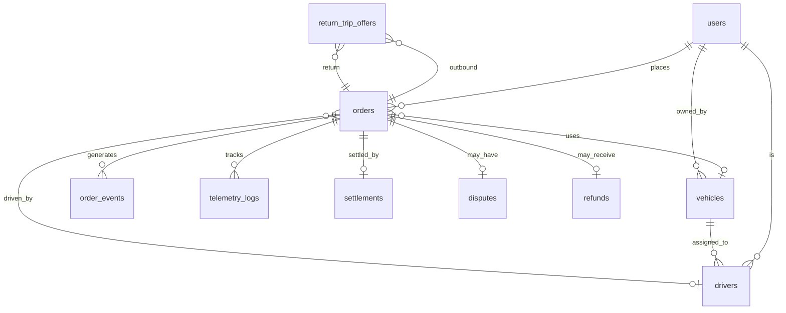

# 🗄️ Database Schema

> [!INFO] Architecture
> PostgreSQL 15 + PostGIS + pgvector
> Primary DB: Supabase

## 📊 Core Tables

### 1. `users` - Platform Users
| Column       | Type         | Description                          |
| ------------ | ------------ | ------------------------------------ |
| `id`         | UUID         | Primary key                          |
| `phone`      | VARCHAR(15)  | Unique phone number                  |
| `email`      | VARCHAR(255) | Email (optional)                     |
| `user_type`  | ENUM         | CUSTOMER, DRIVER, TRANSPORTER, ADMIN |
| `kyc_status` | ENUM         | PENDING, VERIFIED, REJECTED          |
| `created_at` | TIMESTAMP    | Account creation                     |

### 2. `orders` - Shipment Requests
| Column                 | Type          | Description                              |
| ---------------------- | ------------- | ---------------------------------------- |
| `id`                   | UUID          | Primary key                              |
| `state`                | VARCHAR(32)   | Current state (see [[07_State_Machine]]) |
| `customer_id`          | UUID FK       | Customer reference                       |
| `pickup_location`      | Point(GIS)    | Geo coordinates                          |
| `pickup_address`       | TEXT          | Full address                             |
| `pickup_city`          | VARCHAR(100)  | City name                                |
| `drop_location`        | Point(GIS)    | Geo coordinates                          |
| `drop_address`         | TEXT          | Full address                             |
| `drop_city`            | VARCHAR(100)  | City name                                |
| `cargo_type`           | VARCHAR(100)  | Type of cargo                            |
| `weight_kg`            | DECIMAL(10,2) | Cargo weight                             |
| `vehicle_type`         | VARCHAR(50)   | OPEN, CLOSED, TRAILER                    |
| `vehicle_model`        | VARCHAR(100)  | Specific model (optional)                |
| `base_fare`            | DECIMAL(10,2) | Base price                               |
| `gst_amount`           | DECIMAL(10,2) | GST (18%)                                |
| `final_fare`           | DECIMAL(10,2) | Total after discount                     |
| `discount_amount`      | DECIMAL(10,2) | Loop discount                            |
| `loop_group_id`        | UUID          | Links outbound + return                  |
| `is_return_leg`        | BOOLEAN       | True for return trips                    |
| `vehicle_id`           | UUID FK       | Assigned vehicle                         |
| `driver_id`            | UUID FK       | Assigned driver                          |
| `promised_pickup_at`   | TIMESTAMP     | SLA pickup time                          |
| `actual_pickup_at`     | TIMESTAMP     | Real pickup time                         |
| `promised_delivery_at` | TIMESTAMP     | SLA delivery time                        |
| `actual_delivery_at`   | TIMESTAMP     | Real delivery time                       |
| `pod_image`            | IMAGE         | Proof of delivery                        |
| `pod_notes`            | TEXT          | Delivery notes                           |
| `last_event`           | VARCHAR(64)   | Last event type                          |
| `last_actor`           | VARCHAR(32)   | Last agent (OMS, IMS, etc.)              |
| `last_idempotency_key` | VARCHAR(64)   | Retry protection                         |

**Indexes:**
- `(state)` - State queries
- `(customer_id, state)` - Customer orders
- `(vehicle_id, state)` - Vehicle orders
- `(loop_group_id)` - Loop queries
- `(created_at)` - Time-based queries

### 3. `order_events` - Immutable Audit Trail
| Column            | Type        | Description          |
| ----------------- | ----------- | -------------------- |
| `id`              | UUID        | Primary key          |
| `order_id`        | UUID FK     | Order reference      |
| `event_type`      | VARCHAR(64) | What happened        |
| `from_state`      | VARCHAR(32) | Previous state       |
| `to_state`        | VARCHAR(32) | New state            |
| `actor`           | VARCHAR(32) | Who made change      |
| `idempotency_key` | VARCHAR(64) | Unique key           |
| `payload`         | JSONB       | Event data           |
| `payload_hash`    | VARCHAR(64) | SHA-256 of payload   |
| `prev_hash`       | VARCHAR(64) | Previous event hash  |
| `chain_hash`      | VARCHAR(64) | Hash(prev + payload) |
| `created_at`      | TIMESTAMP   | Event timestamp      |

**Constraints:**
- `UNIQUE(order_id, idempotency_key)` - Prevents duplicates

### 4. `vehicles` - Vehicle Inventory
| Column                | Type          | Description                      |
| --------------------- | ------------- | -------------------------------- |
| `id`                  | UUID          | Primary key                      |
| `registration_number` | VARCHAR(20)   | Unique plate                     |
| `vehicle_type`        | VARCHAR(50)   | OPEN, CLOSED, TRAILER            |
| `vehicle_model`       | VARCHAR(100)  | Model name                       |
| `max_weight_kg`       | DECIMAL(10,2) | Capacity                         |
| `max_volume_cft`      | DECIMAL(10,2) | Volume capacity                  |
| `status`              | ENUM          | AVAILABLE, ASSIGNED, MAINTENANCE |
| `owner_id`            | UUID FK       | Transporter/owner                |
| `verification_status` | ENUM          | PENDING, VERIFIED                |

### 5. `drivers` - Driver Profiles
| Column             | Type        | Description              |
| ------------------ | ----------- | ------------------------ |
| `id`               | UUID        | Primary key              |
| `user_id`          | UUID FK     | User account             |
| `vehicle_id`       | UUID FK     | Assigned vehicle         |
| `license_number`   | VARCHAR(50) | Driving license          |
| `status`           | ENUM        | ONLINE, OFFLINE, ON_TRIP |
| `current_location` | Point(GIS)  | Last known location      |

### 6. `return_trip_offers` - Loop Matching
| Column              | Type      | Description                          |
| ------------------- | --------- | ------------------------------------ |
| `id`                | UUID      | Primary key                          |
| `outbound_order_id` | UUID FK   | Completed order                      |
| `return_order_id`   | UUID FK   | Candidate return                     |
| `loop_group_id`     | UUID      | Link ID                              |
| `discount_pct`      | INT       | 20% default                          |
| `total_score`       | DECIMAL   | IMS score                            |
| `expires_at`        | TIMESTAMP | Offer expiry                         |
| `status`            | ENUM      | PENDING, ACCEPTED, REJECTED, EXPIRED |

### 7. `settlements` - Financial Settlements
| Column                | Type          | Description                     |
| --------------------- | ------------- | ------------------------------- |
| `id`                  | UUID          | Primary key                     |
| `order_id`            | UUID FK       | Order reference                 |
| `loop_group_id`       | UUID          | Loop reference                  |
| `base_fare`           | DECIMAL(10,2) | Original fare                   |
| `discount_amount`     | DECIMAL(10,2) | Loop discount                   |
| `gst_amount`          | DECIMAL(10,2) | GST                             |
| `final_fare`          | DECIMAL(10,2) | Total                           |
| `transporter_payout`  | DECIMAL(10,2) | Owner payout                    |
| `driver_payout`       | DECIMAL(10,2) | Driver payout                   |
| `platform_commission` | DECIMAL(10,2) | Zippy share                     |
| `settlement_status`   | ENUM          | PREPROCESSING, READY, COMPLETED |
| `processed_at`        | TIMESTAMP     | Completion time                 |

### 8. `telemetry_logs` - GPS Tracking
| Column             | Type       | Description       |
| ------------------ | ---------- | ----------------- |
| `id`               | UUID       | Primary key       |
| `order_id`         | UUID FK    | Order reference   |
| `vehicle_id`       | UUID FK    | Vehicle reference |
| `driver_id`        | UUID FK    | Driver reference  |
| `location`         | Point(GIS) | GPS coordinates   |
| `speed`            | DECIMAL    | Speed in km/h     |
| `accuracy`         | DECIMAL    | GPS accuracy      |
| `device_timestamp` | TIMESTAMP  | Device time       |

### 9. `disputes` - SLA Breach Records
| Column         | Type    | Description                                              |
| -------------- | ------- | -------------------------------------------------------- |
| `id`           | UUID    | Primary key                                              |
| `order_id`     | UUID FK | Order reference                                          |
| `dispute_type` | ENUM    | PICKUP_DELAY, DELIVERY_DELAY, POD_DELAY, ROUTE_DEVIATION |
| `severity`     | ENUM    | LOW, MEDIUM, HIGH, CRITICAL                              |
| `ai_score`     | DECIMAL | Dispute AI score                                         |
| `status`       | ENUM    | OPEN, RESOLVED, ESCALATED                                |
| `resolution`   | TEXT    | Resolution notes                                         |

### 10. `refunds` - Refund Records
| Column                | Type          | Description                  |
| --------------------- | ------------- | ---------------------------- |
| `id`                  | UUID          | Primary key                  |
| `order_id`            | UUID FK       | Order reference              |
| `refund_type`         | ENUM          | PARTIAL, FULL, CANCELLATION  |
| `base_refund_amount`  | DECIMAL(10,2) | Original amount              |
| `total_refund_amount` | DECIMAL(10,2) | Final amount                 |
| `refund_status`       | ENUM          | PENDING, APPROVED, PROCESSED |
| `reason`              | TEXT          | Refund reason                |
| `idempotency_key`     | VARCHAR(64)   | Retry protection             |

## 🔗 Entity Relationships

## 🔗 Related Notes
- [[07_State_Machine]] - Order state transitions
- [[02_Agentic_AI_Application]] - Agent data access
- [[06_Tech_Stack_Architecture]] - Database technology

---
*Status: 🟢 Production Schema*
*Implementation: MiniMax Agent Generated*
