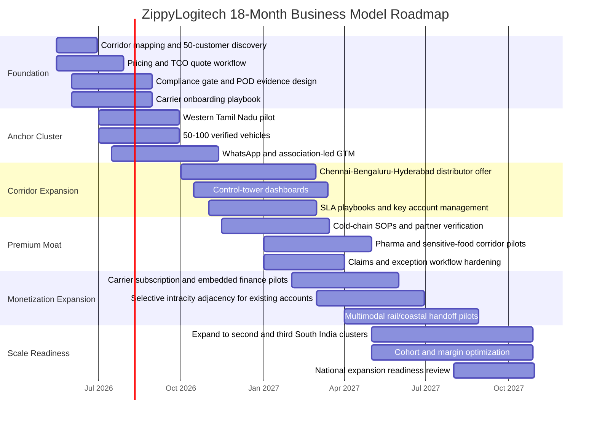

# ZippyLogitech Business Model Blueprint

Prepared: May 3, 2026

## Executive Summary

ZippyLogitech should not try to win by owning trucks, outspending national logistics incumbents, or becoming another generic load board. The strongest business model is a South India-first, asset-light orchestration platform that sells trust, utilization, compliance, faster settlement, and operational clarity into fragmented freight corridors.

The recommended model is:

> Cluster-first asset-light PTL/FTL orchestration + 3PL/4PL control tower + cold-chain compliance corridors.

Carrier-facing fintech, subscriptions, insurance, telematics, and SaaS should be attach layers after shipment density exists. A broad national marketplace or generic metro last-mile play should be deferred.

The first strategic wedge should be Western Tamil Nadu and adjacent South India corridors, where MSME freight, textile exports, auto/EV components, industrial goods, small fleet owners, and directional imbalance create a practical opening for return-trip intelligence.

## Strategic Thesis

The business should be built around a simple idea:

> Do not sell trucks. Sell certainty, utilization, settlement speed, and compliance proof.

The current project direction already supports this thesis:

| Existing strategic capability | Business implication |
|---|---|
| Cluster-aware return-trip logic | Launch where route density and lane imbalance create measurable savings |
| Order state machine and transition controls | Build trust through predictable workflow governance |
| Legal/compliance gap roadmap | Turn compliance into a paid premium layer, not an afterthought |
| WhatsApp-first positioning | Fit Indian MSME logistics behavior without forcing app adoption too early |
| Vehicle-fit and pricing logic | Move from quote brokerage to operating intelligence |
| South India market focus | Start concentrated, then expand corridor by corridor |

The company should become the freight operating brain for underserved South Indian corridors, not a generic truck booking website.

## What Not To Do

| Avoid | Why |
|---|---|
| National generic truck marketplace at launch | Network-effect fight against larger players with deeper supply and demand density |
| Pure lowest-price brokerage | Margin compression, weak loyalty, broker-style commoditization |
| Asset-heavy fleet ownership too early | High capex, operational drag, poor flexibility |
| Broad metro last-mile launch | Crowded market, intense SLA pressure, low differentiation |
| Cold chain as day-one core | Premium opportunity, but claims and compliance failures can destroy margin if base ops are immature |
| App-only onboarding | MSMEs and drivers may prefer WhatsApp, calls, and assisted workflows first |

## Recommended Business Model Stack

### Layer 1: Cluster-First Asset-Light Orchestration

This is the launch model and the core revenue engine.

ZippyLogitech coordinates shippers, carriers, drivers, and transport partners without owning the vehicles. It monetizes completed freight movement and creates differentiation through route intelligence, verified supply, pricing transparency, POD capture, settlement speed, and return-load matching.

Revenue streams:

- Orchestration fee on completed shipments
- Return-trip optimization premium
- Priority matching fee
- Visibility/POD fee for high-value shippers
- Route subscription for repeat MSME customers

Best first use cases:

- Textile and garment freight
- Engineering goods
- Auto and EV components
- Industrial supplies
- Export cargo to port corridors

### Layer 2: 3PL/4PL Control Tower

This is the higher-LTV layer for B2B distributors and larger recurring accounts.

The control tower should offer planning, execution visibility, exception management, SLA reporting, carrier coordination, payment status, and audit trails. This is where ZippyLogitech becomes less rate-card vendor and more logistics partner.

Revenue streams:

- Monthly management fee
- SLA premium
- Software/control-tower subscription
- Analytics/reporting fee
- Integration/setup fee for ERP, WMS, or large accounts

Best use cases:

- FMCG distributors
- Pharma distributors
- Auto-component suppliers
- Electronics and EMS vendors
- Multi-city channel distribution

### Layer 3: Cold-Chain Compliance Corridors

This should be a premium expansion layer after the base operating loop is stable.

Cold chain is attractive because customers pay for proof, not just movement. But the product must be disciplined: temperature logs, verified reefer partners, exception alerts, claim workflow, insurance support, and digital POD.

Revenue streams:

- Per-shipment cold-chain premium
- Temperature monitoring fee
- Compliance report fee
- Packaging/validation partner margin
- Retainer for recurring pharma/food lanes

Best use cases:

- Pharma distribution
- Diagnostics
- Seafood exports
- Dairy
- Fresh produce and processed foods

### Layer 4: Carrier OS And Embedded Finance

This is an attach model, not the launch core.

Once ZippyLogitech controls enough freight density, it can monetize the supply side through tools that improve utilization and cash flow.

Revenue streams:

- Fast-settlement fee
- Insurance referral commission
- Fuel/FASTag partnership revenue
- Telematics/GPS subscription
- Driver/fleet SaaS lite
- Working capital referral revenue

Best use cases:

- Small fleet owners with 3-15 vehicles
- Driver-cum-owners
- Regional transport partners

## Customer Segmentation

### Demand-Side Segments

| Segment | Firmographic profile | Core need | Pain points | Priority |
|---|---|---|---|---|
| MSME manufacturers and micro warehouses | 1-3 facilities in industrial clusters | Reliable booking and visibility without enterprise complexity | Opaque pricing, manual follow-up, poor ETA, weak carrier trust | Priority 1 |
| B2B distributors | Multi-city FMCG, pharma, auto, electronics, channel distribution | Predictable OTIF and control-tower visibility | OTIF penalties, inventory buffers, fragmented vendors, weak reporting | Priority 2 |
| Cold-chain shippers | Pharma, diagnostics, seafood, dairy, fresh categories | Proof of compliant temperature-controlled movement | Spoilage, claims, documentation burden, weak cold continuity | Priority 3 |
| Exporters | Textile, engineering, seafood, auto-component exporters | Deadline-driven port/airport movement | Cutoff risk, document friction, uncertain pickup/delivery | Priority 3 |
| E-commerce and D2C sellers | D2C brands, marketplace sellers, replenishment-heavy operators | Fast replenishment and returns | Cost pressure, high SLA sensitivity, churn | Priority 4 |

### Supply-Side Segments

| Segment | Core need | ZippyLogitech offer |
|---|---|---|
| Driver-cum-owners | More loaded kilometers and faster payment | Return-load alerts, T+1 settlement, verified shippers, POD workflow |
| Small fleet owners | Higher vehicle utilization and lower idle time | Route earnings dashboard, repeat lanes, settlement visibility |
| Local brokers | Business continuity with more digital control | Verified partner role, commission transparency, better demand access |
| Transport companies | Fill excess capacity and place orders when short | Dual-role customer/provider network |

Small fleet owners are foundational even if they are not the first direct revenue segment. Without carrier loyalty, the rest of the model becomes fragile.

## Beachhead Strategy

### Recommended Beachhead: Western Tamil Nadu Freight Loop

Focus locations:

- Coimbatore
- Tiruppur
- Erode
- Salem
- Karur
- Chennai Port
- Bengaluru
- Hosur

Why this works:

- Dense MSME manufacturing base
- Textile and export cargo concentration
- Industrial and engineering freight
- Practical repeat lanes
- Directional imbalance that can be improved through triangle routing
- Strong fit for WhatsApp-first sales and local partner onboarding

### First Productized Services

| Service | Target customer | Value proposition |
|---|---|---|
| Coimbatore to Tiruppur Daily Shuttle | Textile mills, traders, garment units | Frequent short-haul movement with predictable pickup and settlement |
| Tiruppur to Chennai Port Export Express | Garment exporters | Deadline-aware export movement with POD and document discipline |
| Hosur to Bengaluru Auto/EV Component Logistics | Auto, EV, electronics suppliers | Reliable short-haul movement for JIT and supplier-network cargo |

## Value Proposition

### For Shippers

- Verified vehicles and transport partners
- WhatsApp-first booking
- Route-specific pricing
- Cheapest, fastest, and SLA-safe quote options
- Live status updates
- Digital POD
- GST/e-way bill discipline
- Faster dispute resolution
- Repeat-route intelligence

### For Drivers And Fleet Owners

- Return-trip recommendations
- Load alerts before destination arrival
- Faster settlement
- Verified shipper network
- Reduced waiting uncertainty
- Driver/fleet reputation score
- Document and POD support
- Route earnings visibility

### For Transport Companies

- Role switching between customer and provider
- Fleet utilization dashboard
- Partner marketplace
- Received and placed order views
- Driver and vehicle assignment tools
- Revenue/expense visibility
- Shared lane intelligence

## Pricing Blueprint

### Shipper Pricing

| Customer type | Pricing model |
|---|---|
| One-time SME | Freight quote includes margin |
| Repeat SME | Monthly route plan or priority fee |
| Exporter/manufacturer | SLA-based pricing by route |
| B2B distributor | Control-tower fee plus shipment margin |
| Cold-chain customer | Premium compliance and monitoring fee |
| Enterprise account | Contract pricing with reporting and integration fees |

### Carrier Pricing

| Service | Pricing model |
|---|---|
| Basic load matching | Success commission |
| Return-trip priority | Subscription or enhanced commission |
| Fast settlement | Fee or fintech partner revenue |
| Insurance/fuel/FASTag | Partner referral revenue |
| Driver score and route analytics | Free initially, paid later for advanced tools |

### Suggested Early Revenue Mix

| Revenue stream | Launch stage |
|---|---|
| Shipment orchestration fee | Day one |
| Priority route matching | Day one |
| Route subscription | After repeat shippers emerge |
| Control-tower subscription | After distributor pilots |
| Cold-chain compliance premium | After SOP maturity |
| Embedded finance/insurance | After supply-side density |

## Operating Blueprint

| Step | Workflow | System/owner |
|---|---|---|
| 1. Lead and lane discovery | Capture origin, destination, cargo, frequency, urgency, shipment value, and pain points | Sales + pricing |
| 2. Vehicle-fit intelligence | Recommend vehicle type based on weight, dimensions, cargo type, route, and loading constraints | IMS/product |
| 3. Quote design | Offer cheapest, fastest, and SLA-safe options with transparent assumptions | Pricing + control tower |
| 4. Carrier match | Match verified vehicle/driver with route familiarity and return-leg potential | Network ops + IMS |
| 5. Compliance gate | Check documents, permits, insurance, weight, e-way bill need, and restricted cargo flags | Compliance + system |
| 6. Dispatch | Send driver/customer updates through WhatsApp/SMS/app | TMS/control tower |
| 7. In-transit management | Track ETA, delays, exception reasons, route deviation, and customer updates | Control tower |
| 8. POD and delivery close | Capture delivery proof, photos, consignee confirmation, damage notes, and timestamp | Driver app/control tower |
| 9. Settlement | Calculate freight, platform fee, GST, payout, deductions, and payment status | Finance ops |
| 10. Learning loop | Update lane economics, driver score, return-trip probability, and customer repeat profile | Data + ops |

## Compliance As A Business Advantage

The legal compliance gap analysis shows that compliance is not yet fully implemented in the backend. That gap should become a roadmap priority because it can also become a paid differentiator.

Minimum compliance spine:

- Vehicle and driver document verification
- E-way bill and GST metadata
- Dispatch compliance gate
- Digital POD evidence
- Payment and settlement state
- Legal audit logs
- Incident and dispute records
- DPDP consent records
- Insurance and claim workflow

Premium compliance products:

- Cold-chain temperature proof
- High-value cargo seal and evidence workflow
- SLA and delay evidence reports
- Export movement documentation support
- Enterprise audit dashboard

## KPI Dashboard

| KPI family | Metric | Initial target |
|---|---|---:|
| Commercial | Active shipper accounts in anchor cluster | 200+ |
| Commercial | Repeat order rate | 30%+ |
| Commercial | Quote response time for priority routes | Under 10 minutes |
| Unit economics | CAC payback | Under 6 months for SME customers |
| Unit economics | Contribution margin after direct ops | 40%+ |
| Operational | Empty km ratio | Below 25% in pilot, then below 20% |
| Operational | Return-trip conversion | 15-25% healthy, 30%+ excellent |
| Operational | Settlement cycle | T+1 target where feasible |
| Quality | On-time pickup/delivery | 95%+ on target corridors |
| Quality | Digital POD capture | 90%+ in MVP, then 98%+ |
| Compliance | Illegal dispatch transitions | 0 |
| Compliance | Expired document dispatches | 0 |
| Support | Dispute resolution time | Under 24 hours for standard cases |

## 18-Month Roadmap

## Milestones

### 0-90 Days

- Validate 3 priority corridors
- Onboard 50-100 verified vehicles
- Win 30 repeat shippers
- Launch WhatsApp booking workflow
- Capture baseline empty km by lane
- Implement digital POD process
- Define dispatch compliance checklist

### 3-6 Months

- Reach 200 active shippers in anchor cluster
- Maintain under-10-minute quote response on priority routes
- Achieve 30%+ repeat order rate
- Reduce empty km below 25%
- Launch basic shipper route subscription
- Add payment and settlement status visibility

### 6-12 Months

- Launch B2B distributor control-tower pilots
- Add exception dashboards and SLA reports
- Add e-way bill/GST metadata flow
- Launch carrier loyalty and return-load priority
- Prepare cold-chain SOPs and verified partner list

### 12-18 Months

- Launch cold-chain corridor pilots
- Add claims and insurance workflow
- Pilot embedded finance/insurance/fuel partnerships
- Expand to second and third South India clusters
- Review readiness for selective national expansion

## Team Blueprint

| Function | First roles |
|---|---|
| Revenue | Cluster GM, 2 field sales reps, 1 enterprise account executive, 1 customer success manager |
| Network | Carrier acquisition lead, 2 carrier success reps, 1 pricing/procurement analyst |
| Operations | Control-tower manager, 2 shipment coordinators, 1 quality/compliance lead |
| Product and data | Product manager, engineering lead, data analyst, QA/release owner |
| Finance and governance | Finance ops lead, reconciliation analyst, compliance executive |
| Cold chain | Quality lead plus shared operations support |

## Risk Register

| Risk | Impact | Mitigation |
|---|---|---|
| Corridor density builds slowly | Weak matching, poor return-load conversion | Start with 3 corridors, not 30; measure lane economics weekly |
| Generic broker competition | Margin pressure | Sell POD, SLA, settlement, and return-load intelligence, not only rate |
| Poor carrier reliability | Customer trust damage | Verification, scorecards, dispute history, repeat-carrier incentives |
| Payment disputes | Driver churn and working-capital stress | Clear payment status, POD-linked settlement, dispute hold workflow |
| Compliance gap | Legal and operational exposure | Prioritize dispatch gates, document expiry, e-way bill, POD, and audit logs |
| Cold-chain claims | High-value losses | Enter only after SOPs, partner verification, temp logs, and insurance workflow mature |
| Enterprise sales drag | Slow revenue conversion | Use control-tower lite pilots with lane diagnostics before large integrations |

## Final Blueprint

The best business model for ZippyLogitech is not a single revenue line. It is a sequenced stack:

1. Start with cluster-first asset-light PTL/FTL orchestration.
2. Build density in Western Tamil Nadu and nearby South India corridors.
3. Use return-trip intelligence and settlement speed to retain carriers.
4. Sell visibility, POD, and route certainty to MSME shippers.
5. Upgrade repeat B2B accounts into a control-tower product.
6. Add cold-chain compliance corridors once operational discipline is proven.
7. Attach finance, insurance, telematics, and carrier subscriptions after supply density exists.

This keeps ZippyLogitech out of the commodity load-board trap and moves it toward a stronger role: the South India-first orchestration and compliance layer for fragmented freight.

